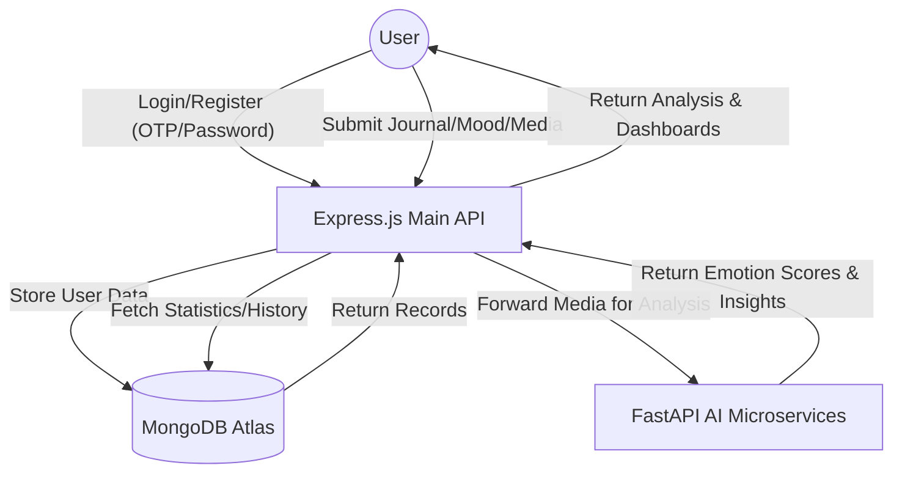
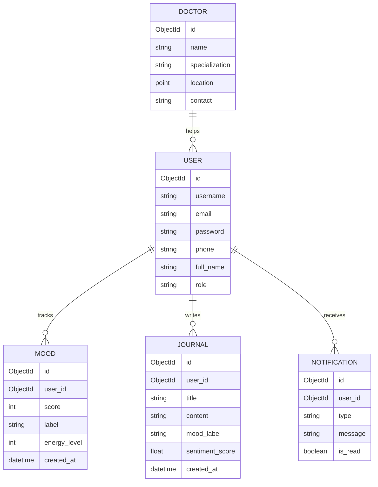

# Technical Appendices - MindfulAI

This document provides the technical diagrams and data structures required for the project documentation.

---

## Appendix A: Data Flow Diagram (DFD) - Level 1

The following diagram illustrates the flow of information between the User, the central API, and the specialized AI microservices.



---

## Appendix B: Entity-Relationship Diagram (ERD)

MindfulAI uses a document-oriented structure with MongoDB. The relationships are defined by ObjectIDs.



---

## Appendix C: Use-Case Diagram (UCD)

The primary interactions available to the User and the interaction between the system and AI services.

```mermaid
useCaseDiagram
    actor "General User" as User
    actor "AI Engine" as AI
    actor "Healthcare Professional" as Doc

    rectangle "MindfulAI Platform" {
        User -- (Register/Login)
        User -- (Track Mood)
        User -- (Write Journal)
        User -- (View Wellness Analytics)
        User -- (Find Nearby Specialists)
        
        (Write Journal) ..> (Analyze Sentiment) : include
        (Analyze Sentiment) -- AI
        
        (Find Nearby Specialists) -- Doc
        (Analyze Facial Expression) -- AI
        User -- (Face Mood Check)
    }
```

---

## Appendix D: Data Dictionary (DD)

### 1. User Entity
| Field | Type | Description | Constraints |
| :--- | :--- | :--- | :--- |
| `_id` | ObjectId | Primary Key (System Generated) | Unique |
| `username` | String | Unique handle for the user | Required, 3-30 chars |
| `email` | String | User's email address | Required, Unique, Email Format |
| `password` | String | Hashed password (Bcrypt) | Required, Min 6 chars, Secret |
| `full_name` | String | User's legal name | Required |
| `phone` | String | Contact number for OTP | Optional, Unique |
| `role` | String | User permission level | Enum [user, therapist, admin] |

### 2. Mood Entity
| Field | Type | Description | Constraints |
| :--- | :--- | :--- | :--- |
| `user` | ObjectId | Reference to the common User | Required |
| `score` | Number | Numeric mood rating (1-10) | Required, Min 1, Max 10 |
| `label` | String | Text descriptor of mood (e.g. Joy) | Required |
| `energy_level` | Number | Energy intensity (1-10) | Min 1, Max 10 |
| `note` | String | Optional context note | - |

---

## Appendix E: Recommended Screen Shots

For your documentation, please capture the following screens from the live application running on `localhost:3000`:

1.  **Welcome / Landing Page:** Showing the premium glassmorphism design.
2.  **Auth Protocol:** The login screen showing both "Password" and "OTP Code" tabs.
3.  **Wellness Dashboard:** The main dashboard showing the mood chart and activity status.
4.  **Mood Wheel:** The interactive UI used for mood check-ins.
5.  **Specialist Directory:** Showing the list of doctors with their distance in kilometers.
6.  **AI Analysis Result:** A screen showing the journal analysis or facial emotion score.
7.  **Responsive View:** A screenshot of the dashboard on a mobile screen size.
